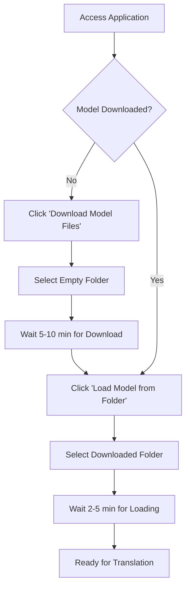
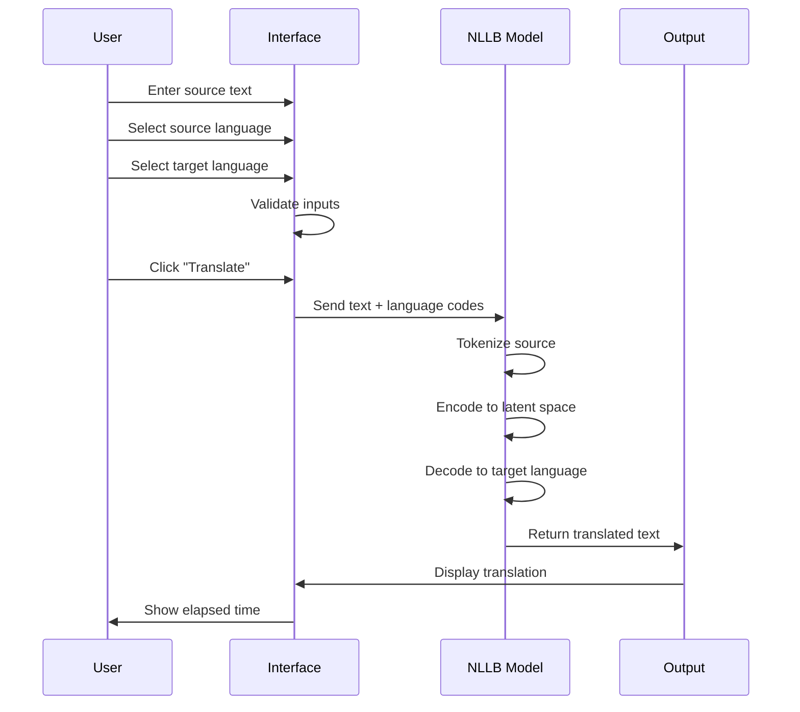
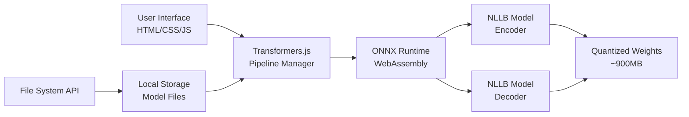

# xsukax Offline Translator

[](https://xsukax.github.io/xsukax-Offline-Translator)
[](https://www.gnu.org/licenses/gpl-3.0)
[](https://huggingface.co/Xenova/nllb-200-distilled-600M)

A privacy-first, fully offline neural machine translation application supporting 200+ languages. Built on Meta's NLLB-200 model, this tool runs entirely in your browser without requiring server infrastructure or internet connectivity after initial model download.

**[🌐 Live Demo](https://xsukax.github.io/xsukax-Offline-Translator)**

---

## Project Overview

xsukax Offline Translator is a client-side web application that provides professional-grade machine translation capabilities for over 200 languages and language variants. Powered by the Xenova/transformers.js implementation of Meta's No Language Left Behind (NLLB) 600M distilled model, it delivers accurate translations across diverse scripts including Latin, Arabic, Cyrillic, Devanagari, CJK, and many others.

The application leverages modern browser APIs (File System Access API, Web Workers via transformers.js) to download the neural translation model once (~900MB) and store it locally on your filesystem. Subsequent translation operations execute entirely offline, ensuring complete data sovereignty and eliminating dependency on external translation services.

### Core Capabilities

- **200+ Language Support**: Comprehensive coverage including major world languages, regional dialects, and low-resource languages
- **True Offline Operation**: Zero network requests after model acquisition; all processing occurs locally
- **Neural Translation Quality**: State-of-the-art NLLB architecture optimized for cross-lingual accuracy
- **Browser-Native Implementation**: No installation, compilation, or backend infrastructure required
- **Bidirectional Translation**: Seamless language swapping with preserved translation history
- **Cross-Platform Compatibility**: Runs on any modern Chromium-based browser (Chrome, Edge, Opera, Brave)

---

## Security and Privacy Benefits

This application implements a privacy-by-design architecture that fundamentally protects user data through technical measures rather than policy promises:

### Complete Data Locality
All translation processing executes within the browser sandbox using WebAssembly-compiled ONNX models. Source text, translations, and model parameters never leave your device. There are no external API calls, analytics tracking, or telemetry systems—network activity is limited solely to the optional one-time model download from Hugging Face's CDN.

### No Server-Side Processing
Unlike cloud-based translation services, this application eliminates the entire server-side attack surface. There is no backend infrastructure to compromise, no databases storing user content, and no logs capturing translation requests. This architecture prevents data breaches, unauthorized access, and third-party data sharing by design.

### Model Transparency and Auditability
The translation model is open-source (Meta NLLB-200), quantized for efficiency, and served from a public repository. Users can verify model integrity, inspect the transformation pipeline, and audit the entire codebase. The deterministic nature of the File System Access API ensures that model files remain unmodified between sessions.

### Regulatory Compliance Advantages
By processing sensitive content locally, organizations can maintain compliance with data protection regulations (GDPR, HIPAA, CCPA) that restrict cross-border data transfers or third-party processing. Legal documents, medical records, proprietary business communications, and personal information remain under exclusive user control throughout the translation workflow.

### Browser Security Model
The application benefits from Chrome's site isolation, same-origin policy enforcement, and Content Security Policy protections. CORS restrictions prevent unauthorized cross-origin requests, while the sandboxed execution environment isolates translation operations from other browser tabs and system resources.

---

## Features and Advantages

### Technical Differentiators

- **Quantized Model Optimization**: 8-bit quantized ONNX runtime reduces memory footprint to ~900MB while preserving translation quality, enabling deployment on consumer hardware
- **Progressive Model Loading**: Asynchronous initialization with real-time progress feedback ensures responsive UI during the 2-5 minute first-load experience
- **Intelligent Caching Strategy**: Browser-native caching mechanisms (via transformers.js) accelerate subsequent model loads to <10 seconds
- **Multi-Script Typography**: Tested rendering pipeline for complex scripts including Arabic (RTL), Devanagari conjuncts, CJK ideographs, and Ethiopic syllabary
- **Graceful Degradation**: Clear error handling for unsupported browsers with actionable guidance for users

### User Experience Benefits

- **Zero Configuration**: No API keys, authentication, or account creation required
- **Predictable Performance**: Translation latency depends only on local hardware, not network conditions or rate limits
- **Unlimited Usage**: No quotas, throttling, or usage-based pricing constraints
- **Offline Resilience**: Fully functional in air-gapped environments, remote locations, or during network outages
- **Language Pair Flexibility**: All 40,000+ language pair combinations supported without additional downloads

### Enterprise and Research Applications

- **Sensitive Document Translation**: Medical records, legal contracts, classified materials, and confidential business documents
- **Field Operations**: Humanitarian missions, military deployments, and remote fieldwork with limited connectivity
- **Cost Optimization**: Eliminate per-character API fees for high-volume translation workflows
- **Research Reproducibility**: Deterministic translation outputs enable consistent results across experiments
- **Custom Integration**: Embeddable in electron apps, PWAs, or other web-based tools via simple iframe inclusion

---

## Installation Instructions

### Prerequisites

- **Browser Compatibility**: Chrome 86+, Edge 86+, Opera 72+, or Brave 1.17+ (requires File System Access API support)
- **Disk Space**: Minimum 1GB free space for model storage
- **Memory**: Recommended 4GB+ RAM for optimal translation performance
- **Operating System**: Windows 10+, macOS 10.15+, or Linux with modern desktop environment

### Deployment Methods

#### Method 1: Direct GitHub Pages Access
1. Navigate to the live demo: [https://xsukax.github.io/xsukax-Offline-Translator](https://xsukax.github.io/xsukax-Offline-Translator)
2. Bookmark the page for quick access
3. Proceed to model download (see Usage Guide)

#### Method 2: Local Hosting
1. Clone the repository:
   ```bash
   git clone https://github.com/xsukax/xsukax-Offline-Translator.git
   cd xsukax-Offline-Translator
   ```

2. Serve the application using any static file server:
   ```bash
   # Python 3
   python -m http.server 8000
   
   # Node.js (http-server)
   npx http-server -p 8000
   
   # PHP
   php -S localhost:8000
   ```

3. Access `http://localhost:8000` in your browser

#### Method 3: Direct File Access
1. Download `index.html` from the repository
2. Open directly in a Chromium-based browser
3. Note: File System Access API requires secure context (localhost or HTTPS)

### Server Configuration (Optional)

When self-hosting, ensure your web server serves the correct MIME types for optimal performance:

**Apache (`.htaccess` or `httpd.conf`):**
```apache
AddType application/json .json
AddType application/wasm .wasm
```

**Nginx (`nginx.conf`):**
```nginx
types {
    application/json json;
    application/wasm wasm;
}
```

**PHP Development Server (`php.ini` configuration):**
```ini
; Ensure JSON and WASM files are served with correct MIME types
; No additional configuration typically required for PHP built-in server
; If issues arise, verify extension loading:
extension=json
```

---

## Usage Guide

### Initial Setup Workflow



### Step-by-Step Instructions

#### First-Time Setup

1. **Launch Application**
   - Open the application URL in a supported browser
   - You will see the interface with model management controls at the top

2. **Download Model Files**
   - Click the **"Download Model Files"** button (orange)
   - Browser will prompt you to select a folder
   - **Important**: Choose an empty folder or create a new one for model storage
   - The download process will fetch 7 files (~900MB total) from Hugging Face
   - Progress indicator shows download status for each file
   - Estimated time: 5-10 minutes on typical broadband connection

3. **Load Model into Memory**
   - After successful download, click **"Load Model from Folder"** (green)
   - Select the same folder containing the downloaded model files
   - The application will verify file integrity (all 7 files must be present)
   - Model loading into browser memory takes 2-5 minutes
   - Progress bar shows loading percentage
   - Status indicator changes to "✅ Offline model loaded and ready"

#### Translation Workflow



1. **Enter Source Text**
   - Type or paste text into the "Source Text" textarea
   - Maximum recommended length: 512 tokens (~400 words)
   - Longer texts may be automatically truncated

2. **Select Languages**
   - Choose source language from "From" dropdown (200+ options)
   - Choose target language from "To" dropdown
   - Languages are sorted alphabetically by display name
   - Default selection: English → Spanish

3. **Execute Translation**
   - Click **"Translate"** button (requires all fields filled)
   - Keyboard shortcut: `Ctrl+Enter` (Windows/Linux) or `Cmd+Enter` (macOS)
   - Translation typically completes in 1-10 seconds depending on:
     - Text length
     - Language pair complexity
     - Hardware specifications (CPU speed, available RAM)

4. **Review Output**
   - Translated text appears in the "Translation Output" section
   - Metadata displays: source language → target language | processing time
   - Copy output text directly from the box

#### Advanced Features

**Swap Languages**
- Click the **"⇄ Swap"** button between language dropdowns
- Automatically exchanges source/target languages
- If a translation is present, swaps input/output text as well
- Useful for quick back-translation or bidirectional conversations

**Clear All Fields**
- Click **"Clear"** button to reset source text and output
- Does not unload the model from memory
- Preserves language selections

**Model Information Panel**
- Displays after successful model load
- Shows: model name, size, source (local/folder), and status
- Lists all 7 loaded model files for verification

### Supported Language Coverage

The application supports 200+ language codes covering diverse language families and scripts:

**Major Languages**: English, Spanish, French, German, Chinese (Simplified/Traditional), Arabic, Russian, Japanese, Korean, Hindi, Portuguese, Italian, Turkish, Vietnamese, Polish, Ukrainian, Thai, Hebrew, Indonesian, Greek, Czech, Swedish, Dutch, Romanian, Hungarian, and many more

**Regional Variants**: Egyptian Arabic, Moroccan Arabic, Swiss German, Brazilian Portuguese, Quebec French, etc.

**Low-Resource Languages**: Bambara, Fon, Dyula, Kinyarwanda, Shona, Tigrinya, Quechua, and 100+ additional languages often excluded from commercial services

**Script Coverage**: Latin, Arabic, Cyrillic, Devanagari, Bengali, Tamil, Telugu, Gujarati, Kannada, Malayalam, Sinhala, Thai, Lao, Burmese, Khmer, Amharic, Tigrinya, Georgian, Armenian, Hebrew, Chinese (Simplified/Traditional), Japanese (Kanji/Hiragana/Katakana), Korean (Hangul), and more

### Performance Expectations

| Hardware Tier | Model Load Time | Translation Speed (100 words) |
|--------------|-----------------|-------------------------------|
| High-end (8+ core CPU, 16GB+ RAM) | 1-2 minutes | 1-3 seconds |
| Mid-range (4-8 core CPU, 8GB RAM) | 2-4 minutes | 3-7 seconds |
| Low-end (2-4 core CPU, 4GB RAM) | 4-6 minutes | 7-15 seconds |

*Note: Times are approximate and vary based on browser, OS, and background processes*

### Troubleshooting

**Issue**: "File System Access API not supported" error
- **Solution**: Use Chrome 86+, Edge 86+, Opera 72+, or Brave 1.17+. Safari and Firefox do not currently support this API.

**Issue**: Model download fails or times out
- **Solution**: Check internet connection stability. Try downloading during off-peak hours. Verify Hugging Face CDN is accessible in your region.

**Issue**: "Missing files" error during model load
- **Solution**: Ensure all 7 model files are present in the selected folder. Re-download if any files are corrupted. Check folder permissions.

**Issue**: Translation takes extremely long or freezes browser
- **Solution**: Close other browser tabs to free memory. Avoid translating text >500 words in a single request. Restart browser if memory leak suspected.

**Issue**: Output shows garbled characters for certain languages
- **Solution**: Ensure your system has appropriate fonts installed for the target script (e.g., Noto Sans for comprehensive Unicode coverage).

---

## Technical Architecture

### System Components



### Key Technologies

- **Frontend Framework**: Vanilla JavaScript (ES6+) with Tailwind CSS for responsive UI
- **ML Inference Engine**: [Transformers.js v2.17.2](https://github.com/xenova/transformers.js) by Xenova
- **Model Format**: ONNX (Open Neural Network Exchange) with 8-bit quantization
- **Translation Model**: [NLLB-200 Distilled 600M](https://huggingface.co/Xenova/nllb-200-distilled-600M) by Meta AI
- **Browser APIs**: File System Access API, Web Workers (via transformers.js), Fetch API
- **CDN Dependencies**: Hugging Face Model Hub, jsDelivr (transformers.js), Tailwind CDN

---

## Contributing

Contributions are welcome! Please follow these guidelines:

1. Fork the repository
2. Create a feature branch (`git checkout -b feature/improvement`)
3. Commit changes with descriptive messages
4. Push to your fork and submit a pull request
5. Ensure code follows existing style conventions
6. Add tests for new functionality where applicable

---

## License

This project is licensed under the GNU General Public License v3.0.

---

## Acknowledgments

- **Meta AI Research**: NLLB-200 model development and open-source release
- **Xenova (Joshua Lochner)**: Transformers.js library enabling browser-based inference
- **Hugging Face**: Model hosting infrastructure and ONNX conversion tooling
- **ONNX Runtime**: WebAssembly-optimized inference engine

---

## Contact

- **GitHub Issues**: [Report bugs or request features](https://github.com/xsukax/xsukax-Offline-Translator/issues)
- **Repository**: [https://github.com/xsukax/xsukax-Offline-Translator](https://github.com/xsukax/xsukax-Offline-Translator)

---

**Built with privacy, performance, and accessibility in mind.**
